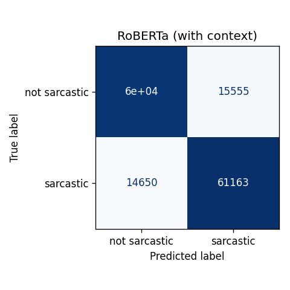

# Sarcasm Detection in Social Media Using Transformer-Based Language Models

**Author:** «Your name» — «Student ID»
**Course / Module:** «Course code and title»
**Supervisor:** «Professor name»
**Date:** «Submission date»
**Code repository:** https://github.com/jan-stochnialek/SarcasmDetection

> 📝 *All results are filled in. Before submitting: complete the header above (name, course, supervisor, date), optionally insert the confusion‑matrix figure in Section 7, then delete this note.*

---

## Abstract

Sarcasm is widespread in online communication yet remains difficult for automatic
systems to detect, because its meaning often contradicts the literal text and
depends on conversational context. This project investigates two questions on the
Self-Annotated Reddit Corpus (SARC): (1) how well modern transformer language
models detect sarcasm compared with a classical baseline, and (2) whether giving
the model the **parent comment** (thread context) improves performance over using
the target comment alone. We compare a TF‑IDF + logistic‑regression baseline,
fine‑tuned **BERT**, and fine‑tuned **RoBERTa**, each trained with and without
context, and assess the context effect with McNemar's statistical significance
test. Our best model, **RoBERTa with context**, achieved **80.0% accuracy** and
**0.885 AUC**. We find that transformers substantially outperform the baseline
(by ≈ 7 percentage points), and that thread context produces a small but
**statistically significant** improvement for both transformer models, while it
significantly *harms* the bag‑of‑words baseline.

---

## 1. Introduction

Sarcasm detection is a challenging sub‑task of sentiment and intent analysis: a
sarcastic statement typically expresses the opposite of its literal meaning, and
human readers rely heavily on context and shared knowledge to recognise it. On
social‑media platforms such as Reddit, sarcasm is common and frequently causes
errors in downstream tasks such as sentiment analysis and content moderation.

The aim of this project is to build and evaluate models that automatically classify
whether a Reddit comment is sarcastic, and to test a specific hypothesis:

> **Research question:** Does adding the preceding (parent) comment as *context*
> improve a model's ability to detect sarcasm, compared with using only the target
> comment?

To answer this we compare three model families across two input conditions
(comment‑only vs. comment‑plus‑context) and measure both predictive performance and
the statistical significance of the context effect.

## 2. Related Work

- **Khodak et al. (2018)** introduced the **SARC** corpus, a large, self‑annotated
  dataset of Reddit comments in which authors mark their own sarcasm with the `/s`
  tag, and provided baseline results and human performance figures.
- **Devlin et al. (2019)** proposed **BERT**, a bidirectional transformer
  pre‑trained on large text corpora that can be fine‑tuned for downstream
  classification, setting the standard approach we adopt here.
- **Liu et al. (2019)** introduced **RoBERTa**, a more robustly optimised
  re‑training of BERT that generally improves downstream accuracy; we include it to
  test whether stronger pre‑training translates into better sarcasm detection.

## 3. Data

We use the **Self‑Annotated Reddit Corpus (SARC)**, in the balanced "danofer/sarcasm"
Kaggle distribution. Each row provides a `label` (1 = sarcastic, 0 = not), the
target `comment`, and the `parent_comment` it replied to (the context). The balanced
subset contains roughly equal numbers of sarcastic and non‑sarcastic comments.

**Pre‑processing.** Text was lightly cleaned to suit pre‑trained models: the Reddit
`/s` sarcasm tag was removed (so the model cannot trivially cheat), URLs and
usernames were replaced with placeholders, and repeated whitespace collapsed. Rows
with an empty comment or parent were dropped.

**Train/test split.** Data were split **85% / 15%** into training and test sets. With
over a million comments, a 15% test set (~151k) is already more than large enough for
low‑variance metric estimates and a well‑powered significance test, so the larger 85%
training share maximises the data available for fine‑tuning; the exact ratio is not
critical at this scale (80/20 or 90/10 give equivalent conclusions). Crucially, the
split is performed **at the thread (parent) level**: every reply to a
given parent goes entirely to one side of the split. This prevents *context leakage*
— in balanced SARC the same parent often appears with both a sarcastic and a
non‑sarcastic reply, so a naive comment‑level split would let the model see a
parent in training and again at test time, inflating the with‑context results.

**Corpus used.** Models were trained on the **full balanced SARC corpus** — 1,010,771
comments after cleaning, split into 859,425 training and 151,346 test comments (the
test set was 50% sarcastic, confirming the balance is preserved).

## 4. Methodology

We evaluate a 3 × 2 experimental matrix — three models, each in two input
conditions:

| | No context (comment only) | With context (parent + comment) |
|---|---|---|
| **Baseline** (TF‑IDF + Logistic Regression) | ✓ | ✓ |
| **BERT** (`bert-base-uncased`, fine‑tuned) | ✓ | ✓ |
| **RoBERTa** (`roberta-base`, fine‑tuned) | ✓ | ✓ |

- **Baseline.** A TF‑IDF vectoriser (unigrams + bigrams, `min_df = 2`) feeding an
  L2‑regularised logistic‑regression classifier. In the context condition the parent
  and comment are concatenated.
- **Transformers.** `bert-base-uncased` and `roberta-base` were fine‑tuned for binary
  classification using the Hugging Face *Transformers* library with a PyTorch
  backend. In the context condition the parent and comment are supplied as a
  **sentence pair**, allowing the model to attend across both via its segment/special
  tokens. Both conditions use the same maximum sequence length, so any difference in
  performance reflects the *content* of the context, not a difference in input length.

**Training configuration.**

| Hyper‑parameter | Value |
|---|---|
| Epochs | 2 |
| Batch size | 96 |
| Learning rate | 2 × 10⁻⁵ |
| Max sequence length | 256 tokens |
| Mixed precision | bf16 |
| Random seed | 42 (fixed) |
| Hardware | NVIDIA RTX PRO 6000 Blackwell (96 GB), via Google Colab |

**Reproducibility.** All randomness (sampling, splitting, weight initialisation,
data shuffling) is controlled by a single fixed seed. Because the data split is fully
deterministic, every model is trained and evaluated on an **identical** test set,
which is what makes the paired with‑/without‑context comparison valid.

## 5. Implementation and Code Structure

The project is organised so that all experiment logic lives in one reusable package
(`engine/`), every experiment is a small self‑contained script, and all tunable
settings sit in a single file. The layout is:

```
project/
├── settings.py               # all knobs: sample size, epochs, batch size, seq length, seed
├── engine/                   # shared library (never run directly)
│   ├── data.py               # load, clean, and thread-level train/test split
│   ├── baseline.py           # TF-IDF + logistic-regression model
│   ├── transformer.py        # fine-tunes BERT / RoBERTa (Hugging Face Trainer)
│   └── scoring.py            # metrics, confusion-matrix figures, results table, McNemar test
├── train_baseline.py         # ── one thin entry-point script per experiment ──
├── train_baseline_context.py
├── train_bert.py  /  train_bert_context.py
├── train_roberta.py  /  train_roberta_context.py
├── run_everything.py         # runs all six experiments in order + prints the comparison
├── check_data.py             # sanity-check the data before training
├── show_results.py           # print the comparison table from saved results
└── notebooks/colab_pro.ipynb # one-click Google Colab runner
```

**What each part does.**

- **`settings.py`** centralises every parameter (`SAMPLE_SIZE`, `EPOCHS`, `BATCH_SIZE`,
  `MAX_TOKENS`, `LEARNING_RATE`, `RANDOM_SEED`), so an experiment is reconfigured by
  editing one value rather than the code.
- **`engine/data.py`** reads the SARC CSV, applies the text cleaning, and produces the
  thread‑level (parent‑grouped) train/test split described in Section 3.
- **`engine/baseline.py`** builds and scores the TF‑IDF + logistic‑regression baseline.
- **`engine/transformer.py`** tokenises the input (a single text, or a parent–comment
  **pair** in the context condition), fine‑tunes the chosen transformer with the Hugging
  Face `Trainer`, and predicts on the test set; mixed precision (bf16) is enabled
  automatically on a capable GPU.
- **`engine/scoring.py`** computes the metrics, writes each model's scores to a JSON file
  and a confusion‑matrix PNG, prints the final comparison table, and runs the McNemar
  significance test between each model's with‑ and without‑context versions.
- The **`train_*.py`** scripts are one‑line entry points (each runs a single model in a
  single condition); **`run_everything.py`** runs all six in order, and
  **`check_data.py`** / **`show_results.py`** support inspection before and after.

This separation keeps the data handling, model code, and scoring written **once** in
`engine/`, while the scripts simply select which model and condition to run — making
every experiment short, readable, and reproducible.

## 6. Evaluation

Each model is scored on the held‑out test set using:

- **Accuracy**, **Precision**, **Recall**, and **F1** (for the sarcastic class), and
- **ROC‑AUC**, which measures ranking quality independently of the decision threshold.

To test our research question rigorously, we compare the no‑context and with‑context
versions of each model with **McNemar's test** (exact binomial form) on their paired
predictions over the same test set. A p‑value below 0.05 indicates that the two
versions make *significantly different* predictions. (Note: this test indicates
whether context changes the predictions, not the *direction* of the change — the
direction is read from the accuracy.)

## 7. Results

**Table 1 — Performance of all six configurations.**

| Model | Accuracy | Precision | Recall | F1 | AUC |
|---|---|---|---|---|---|
| Baseline | 0.725 | 0.740 | 0.694 | 0.717 | 0.799 |
| Baseline + context | 0.686 | 0.697 | 0.658 | 0.677 | 0.753 |
| BERT | 0.783 | 0.784 | 0.782 | 0.783 | 0.866 |
| BERT + context | 0.793 | 0.789 | 0.801 | 0.795 | 0.877 |
| RoBERTa | 0.788 | 0.792 | 0.781 | 0.787 | 0.871 |
| **RoBERTa + context** | **0.800** | **0.797** | **0.807** | **0.802** | **0.885** |

**Table 2 — Does context help? (McNemar's test).**

| Model family | Accuracy change with context | p‑value | Significant (p < 0.05)? |
|---|---|---|---|
| Baseline | **−3.9 pp** (context hurts) | < 0.001 | Yes |
| BERT | **+1.0 pp** (context helps) | < 0.001 | Yes |
| RoBERTa | **+1.2 pp** (context helps) | < 0.001 | Yes |

(McNemar's test reports whether the two versions' predictions differ significantly;
the **direction** of each change is read from the accuracy column.)

Confusion matrices for each model are saved as `*_confusion.png` in the `results/`
folder. Figure 1 shows the matrix for the best model, RoBERTa with context.



**Figure 1.** Confusion matrix for RoBERTa with context (the best model) on the
151,346-comment held-out test set.

## 8. Discussion

The results support three clear findings:

1. **Transformers vs. baseline.** Both BERT (0.783 accuracy, 0.866 AUC) and RoBERTa
   (0.788 / 0.871) clearly outperformed the TF‑IDF baseline (0.725 / 0.799) — a gain
   of roughly **6–7 percentage points** in accuracy and **0.07** in AUC. This confirms
   that contextual pre‑trained language models capture sarcasm cues a bag‑of‑words
   model cannot.
2. **RoBERTa vs. BERT.** RoBERTa outperformed BERT on every metric, in both the
   no‑context and with‑context settings, consistent with its improved pre‑training
   (Liu et al., 2019).
3. **Effect of context.** Adding the parent comment produced a small but
   **statistically significant** improvement for *both* transformers (BERT +1.0 pp,
   RoBERTa +1.2 pp accuracy; both p < 0.001), with RoBERTa‑with‑context giving the
   best result overall (0.800 accuracy, 0.885 AUC). In contrast, context
   significantly *reduced* the baseline's accuracy (−3.9 pp): concatenating the parent
   comment simply adds noise to a linear bag‑of‑words model. This suggests that only a
   sufficiently powerful model can *exploit* conversational context, whereas a weaker
   model is diluted by it.

## 9. Limitations

- **Immediate‑parent context only.** The dataset exposes the single parent comment,
  not the full ancestor thread, so the upper bound on the benefit of context may be
  understated.
- **No hyper‑parameter tuning.** Hyper‑parameters were fixed at standard fine‑tuning
  values rather than tuned on a separate validation set, and no early stopping was
  used; a small additional gain might be possible with tuning.
- **Single random seed.** Results come from one fixed seed; averaging over several
  seeds would further confirm the robustness of the (modest) context effects.

## 10. Conclusion and Future Work

This project built and compared a classical baseline and two fine‑tuned transformer
models for sarcasm detection on Reddit, under matched comment‑only and
comment‑plus‑context conditions. Transformers clearly outperformed the baseline, and
thread context produced a small but statistically significant improvement for both
transformer models (best: RoBERTa with context, 0.800 accuracy / 0.885 AUC), while it
significantly harmed the bag‑of‑words baseline. This directly answers the research
question: conversational context **does** help sarcasm detection — but only for models
powerful enough to exploit it, rather than be diluted by it.

**Future work.** (i) use the full ancestor thread rather than only the immediate
parent; (ii) average results over multiple random seeds to tighten the small context
effects; (iii) explore larger or domain‑adapted transformer models.

## References

Devlin, J., Chang, M.-W., Lee, K., & Toutanova, K. (2019). *BERT: Pre-training of
Deep Bidirectional Transformers for Language Understanding.* In Proceedings of
NAACL‑HLT 2019.

Khodak, M., Saunshi, N., & Vodrahalli, K. (2018). *A Large Self-Annotated Corpus for
Sarcasm.* In Proceedings of LREC 2018.

Liu, Y., Ott, M., Goyal, N., Du, J., Joshi, M., Chen, D., Levy, O., Lewis, M.,
Zettlemoyer, L., & Stoyanov, V. (2019). *RoBERTa: A Robustly Optimized BERT
Pretraining Approach.* arXiv:1907.11692.

## Appendix — Reproducibility

The complete code is available at the repository above. To reproduce:

1. Open `project/notebooks/colab_pro.ipynb` in Google Colab (GPU runtime).
2. Provide the SARC `train-balanced-sarcasm.csv` file (Kaggle: `danofer/sarcasm`).
3. *Run all*. The pipeline trains all six configurations and writes per‑model scores
   (`results/*.json`) and confusion‑matrix figures (`results/*_confusion.png`), then
   prints the comparison table and McNemar significance tests.

Key settings are centralised in `project/settings.py` (`SAMPLE_SIZE`, `EPOCHS`,
`BATCH_SIZE`, `MAX_TOKENS`, `RANDOM_SEED`).
